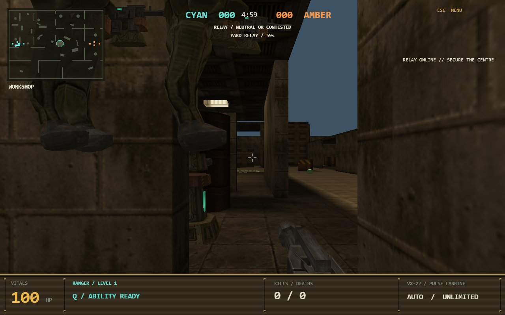
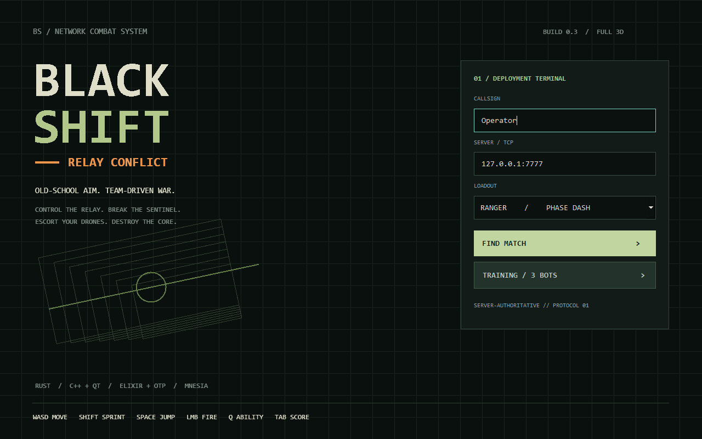
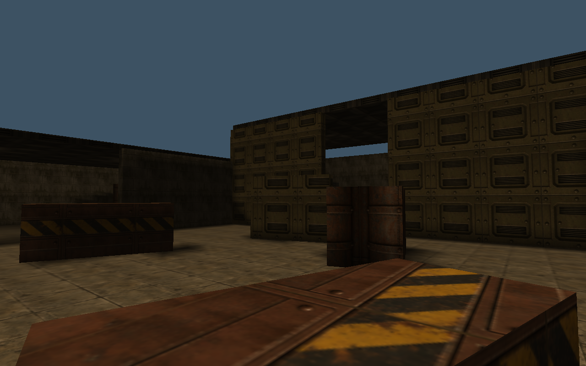
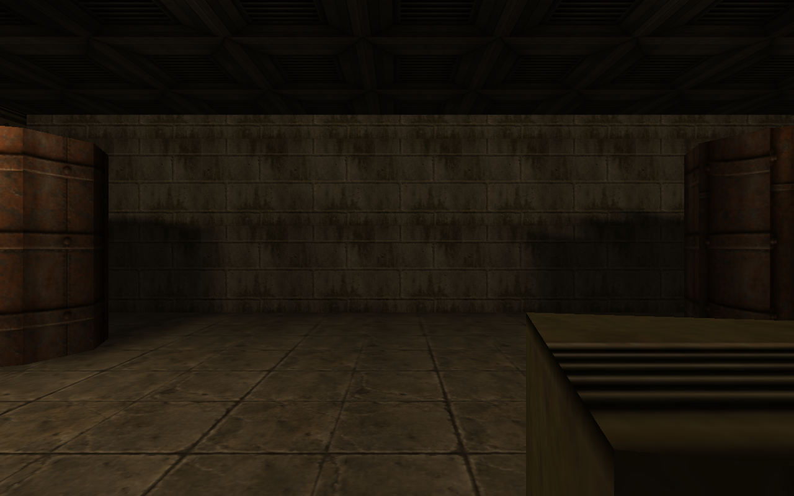
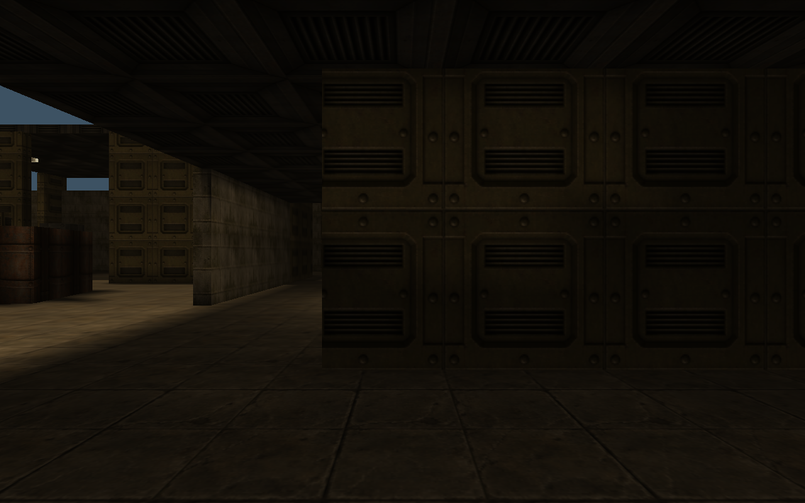

# BLACK SHIFT — Relay Conflict

Сетевой шутер от первого лица с элементами MOBA в индустриальной ретро-эстетике конца 90-х. Сервер на **Elixir/OTP** считает всю игру сам, клиент на **C++/Qt 6 + OpenGL** только показывает её, геометрия и анимация генерируются в **Rust**.



| | |
|---|---|
|  |  |
|  |  |

## Игра

- **Режимы:** онлайн 1 на 1 и тренировка 3 на 3 (вы и два бота против трёх).
- **Классы:** Ranger — рывок и +25% к скорости на 1 секунду после успешного перемещения; Warden — Q лечит себя и союзников на 30 HP, Shift+Q наносит врагам 35 урона (постройкам — 45). Режимы Warden делят перезарядку 8 секунд.
- **Цель-реле** меняет место каждую минуту. Сначала удерживайте её 2 секунды для захвата, затем защищайте без противника: команда получает очки, а бойцы — опыт.
- **Волны дронов** идут каждые 12 секунд с предупреждением за 3 секунды. Зачистка обоих дронов одной вражеской волны даёт команде +4 очка, даже если помогает башня. Башни защищают командное ядро, пока стоят.
- **Удержание:** реле приносит 1 очко в секунду и +5 за каждые 15 секунд непрерывного контроля. Пустая или спорная точка не приносит очков. За 15 секунд до ротации следующая точка появляется на мини-карте.
- **Победа:** уничтожьте ядро противника, наберите 200 очков или ведите по счёту через 5 минут.
- **Опыт и уровни 1–5:** с уровнем растут здоровье и урон.
- **Карта Foundry Heights, 60 × 44 м:** многоуровневый цех, галерея над двором с проходом снизу, рампы, лестница, поднятые насосная и погрузочная терраса, косые укрытия, бочки, вентиляция и шкафы. Боты используют верхние маршруты.

Добавлен индустриальный контент: пульты, насосы, резервуары, генераторы,
кабельные катушки и другие модели; SM-9 у Ranger и дробовик SG-12 у Warden,
различимая экипировка классов, облачное небо и два водных объёма. Вода замедляет,
поддерживает бойца и переносит течением. В глубокой воде удерживайте Space для
всплытия, смотрите вниз и двигайтесь вперёд для погружения.
Подробности и ограничения: [ассеты](docs/assets.md#industrial-expansion).

**Движение и стрельба.** Боец разгоняется и тормозит с инерцией, в прыжке сохраняет
скорость, а в воздухе почти не управляется. Падение с большой высоты ранит. У оружия
есть магазины (SM-9 — 25 патронов, SG-12 — 6, заряжается по патрону), разброс от
движения и очередей, отдача, которую нужно гасить мышью, и спад урона с дистанцией.
Попадание в голову сильнее, в ноги — слабее. Боты видят только перед собой, слышат
выстрелы, реагируют с задержкой, стрейфят, отступают в укрытие и перезаряжаются.
Протокол и числа: [protocol.md](docs/protocol.md#оружие-отдача-и-попадания).

### Управление

| Клавиши | Действие |
|---|---|
| WASD | Движение |
| Мышь, ← → | Обзор |
| Shift | Бег (на земле, только вперёд) |
| Space | Прыжок |
| C или Ctrl | Присесть (точнее стрельба, меньше силуэт) |
| Левая кнопка мыши | Стрельба |
| R | Перезарядка |
| Q | Способность класса |
| Shift+Q | Атакующий импульс Warden |
| Tab | Таблица игроков |
| Esc | Отпустить / захватить курсор; в меню — отменить подключение |
| Enter (курсор отпущен) | Покинуть матч |
| F11 | Полный экран |

## Быстрый старт

Скачайте архив для своей системы со страницы [Releases](../../releases) и распакуйте. В каждом архиве есть клиент, собственный сервер и лаунчер. Лаунчер поднимает локальный сервер, открывает тренировку и останавливает сервер после закрытия игры.

| Система | Архив | Запуск |
|---|---|---|
| Windows 10/11 x64 | `BlackShift-<версия>-windows-x64.zip` | `Play.cmd` |
| Linux x64 (glibc 2.39+, X11 или XWayland) | `BlackShift-<версия>-linux-x64.tar.gz` | `./play.sh` |
| macOS 14+, Apple Silicon | `BlackShift-<версия>-macos-arm64.zip` | `Play.command` |

Сборка для macOS не подписана. После распаковки один раз снимите карантин, иначе macOS заблокирует игру и сервер: `xattr -dr com.apple.quarantine BlackShift-*-macos-arm64`.

```sh
./play.sh --online                                 # Windows: .\Play.ps1 -Online
./play.sh --no-server --server 192.168.1.10:7777   # Windows: .\Play.ps1 -NoServer -Server 192.168.1.10:7777
./play.sh --name Bravo --role warden               # Windows: .\Play.ps1 -Name Bravo -Role warden
```

Нужен видеодрайвер с OpenGL 2.1.

### Свой сервер

Проще всего — Docker-образ. Он публикуется вместе с каждым релизом для `linux/amd64` и `linux/arm64`, точное имя образа есть в описании релиза:

```sh
docker run -d --name blackshift -p 7777:7777 -v blackshift-data:/data ghcr.io/<owner>/<repo>-server:latest
docker compose up -d        # или из исходников, через docker-compose.yml
```

Сервер можно запустить и из любого архива, без Docker:

```sh
export BS_BIND=0.0.0.0 BS_PORT=7777 BS_DB_DIR=$PWD/data/mnesia
server/bin/blackshift start        # Windows: server\bin\blackshift.bat start
server/bin/blackshift stop
server/bin/blackshift rpc 'IO.inspect(BlackShift.Persistence.Store.recent())'   # последние результаты
```

| Переменная | По умолчанию | Назначение |
|---|---|---|
| `BS_BIND` | `127.0.0.1` | Адрес игрового TCP-порта; `0.0.0.0` — для LAN |
| `BS_PORT` | `7777` | Игровой порт |
| `BS_DB_DIR` | `data/mnesia` | Каталог базы результатов |
| `RELEASE_NODE` | `blackshift@localhost` | Имя Erlang-узла; должно быть постоянным для одного каталога базы |

Административная связь Erlang ограничена loopback.

## Архитектура

```text
server/                 Elixir/OTP, авторитетная симуляция 20 Гц, Mnesia
  lib/black_shift/
    game/               чистая симуляция: игрок, физика, бой, боты, постройки, цели, аптечки
    world/              3D-карта, коллизии, навигация
    network/            TCP-слушатель, сессии, протокол JSON Lines
    match/              процесс матча, подбор игроков
    persistence/        результаты матчей в Mnesia
  priv/maps/            карта (встраивается при компиляции)
client/
  core/                 Rust staticlib: модели, скелетный боец, C ABI
  app/                  C++/Qt 6
    src/net             соединение и протокол
    src/game            состояние матча на клиенте
    src/input           клавиатура и мышь
    src/ui              меню, панель подключения, HUD
    src/render          OpenGL-рендер, геометрия мира, анимация
    shaders/            GLSL
assets/                 текстуры, иконка, экспортированные модели
docs/                   документация
packaging/              лаунчеры и файлы релизных архивов
scripts/                сборка, запуск, упаковка
```

Подробнее: [архитектура](docs/architecture.md), [протокол](docs/protocol.md), [формат карты](docs/scene-format.md), [рендер и анимация](docs/rendering.md), [ассеты](docs/assets.md), [тестирование](docs/testing.md).

## Сборка из исходников

Нужны Erlang/OTP 27+, Elixir 1.18+, Rust (MSVC), Visual Studio C++ tools, CMake ≥ 3.24, Qt ≥ 6.4 MSVC x64 (Widgets, Network, OpenGL, OpenGLWidgets).

```powershell
# Erlang/OTP и Elixir локально в build/deps (без изменения системного PATH):
.\scripts\install-beam.ps1
# Qt, если не установлен:
uv tool run --from aqtinstall aqt --config scripts/aqt.ini install-qt windows desktop 6.8.3 win64_msvc2022_64 -O .\build\deps\Qt --archives qtbase

.\scripts\build.ps1                    # тесты + сервер (build/server) + клиент (build/bin)
.\scripts\build.ps1 -TestClient        # плюс нативный тест клиента против сервера
.\scripts\build.ps1 -QtPath C:\Qt\6.8.3\msvc2022_64
.\scripts\play.ps1                     # пересобрать при изменениях и запустить тренировку
.\scripts\package.ps1                  # dist/BlackShift-<версия>-windows-x64.zip
```

Linux (Ubuntu 24.04) и macOS:

```sh
sudo apt install qt6-base-dev qt6-base-dev-tools libgl-dev ninja-build   # Linux; на macOS — Qt с qt.io или через aqt
(cd server && mix test --warnings-as-errors && MIX_ENV=prod mix release --path ../build/server)
cmake -S . -B build/client -DCMAKE_BUILD_TYPE=Release
cmake --build build/client --parallel
scripts/package.sh     # dist/BlackShift-<версия>-linux-x64.tar.gz (с AppImage) или -macos-<arch>.zip
```

Сервер для разработки: `cd server && mix run --no-halt`. Как устроены CI и выпуск релизов, описано в [CONTRIBUTING.md](CONTRIBUTING.md#выпуск-версии).

## Ограничения

Это прототип. В нём нет:

- аккаунтов, рейтинга и переподключения к матчу;
- TLS и UDP;
- предсказания движения на клиенте и компенсации задержек;
- звука.

Снимки раскрывают позиции всех участников, поэтому защиты от wallhack нет. Живые матчи хранятся только в памяти и после падения сервера не восстанавливаются. Навигация ботов поддерживает этажи, рампы и ступени, но не прыжковые связи. Нагрузочная ёмкость не измерялась.

Лимиты прототипа:

- 256 соединений и 64 матча;
- входящее сообщение до 4 КБ, не больше 120 сообщений в секунду;
- молчащий клиент отключается через 15 секунд.

## Лицензия

[MIT](LICENSE). Участие в разработке — [CONTRIBUTING.md](CONTRIBUTING.md), история изменений — [CHANGELOG.md](CHANGELOG.md).
